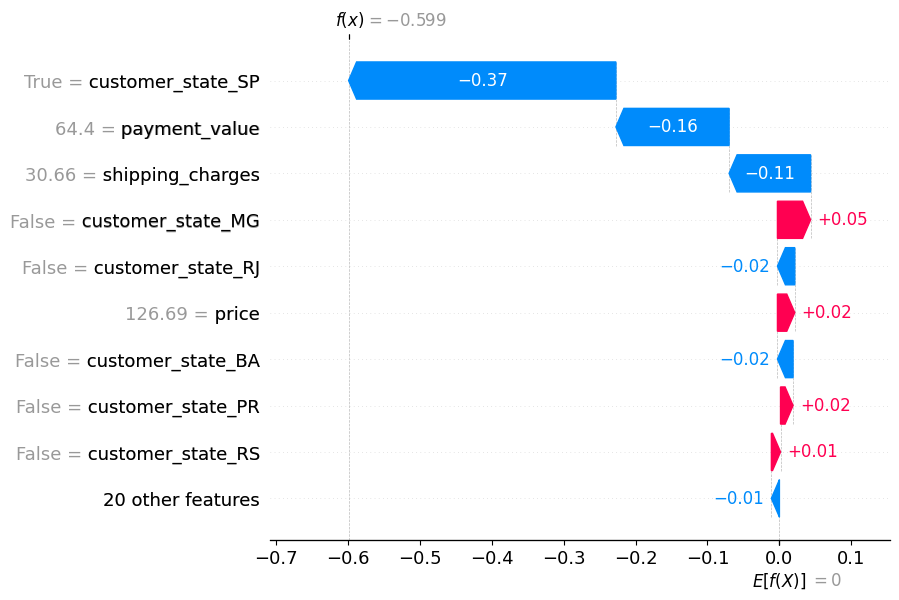

# 📦 🚚  Supply Chain Analytics: E-commerce Late Delivery Risk Prediction with Explainable AI (SHAP)

## 📌 Project Overview

This project builds an end-to-end machine learning system to predict **late delivery risk** in an e-commerce supply chain and explain model decisions using **SHAP (Explainable AI)**.

The goal is not only prediction but also understanding **why delays happen**, enabling better logistics and operational decisions.

---

## 🎯 Business Problem

E-commerce platforms face critical challenges in:

- Late deliveries impacting customer satisfaction
- Inefficient logistics planning
- Lack of visibility into delay drivers

### Key Question:
> Can we predict late deliveries before they happen and understand the key factors behind them?

---

## 💡 Why This Project?

This project demonstrates a real-world machine learning pipeline applied to supply chain operations.

Unlike standard classification problems, this project focuses on:

- Business impact (delivery optimization)
- Imbalanced classification handling
- Model interpretability (SHAP)
- Actionable insights for logistics improvement

## 📦 Dataset

Multi-table e-commerce dataset including:

- Orders (timestamps, delivery status)
- Customers (location, state, ID)
- Payments (payment type, value, installments)
- Products (category, weight, dimensions)
- Order Items (price, shipping cost, seller info)

### Dataset Scale:
- ~50,000+ transactions
- Multi-region customer base
- Multiple product categories

---

## 🧹 Feature Engineering

Key transformations performed:

- Created target variable:
  - `late_delivery = delivered_date > estimated_delivery_date`

- Engineered features:
  - delivery_days
  - shipping_charges
  - payment_value
  - price
  - customer_state (one-hot encoded)

- Handled categorical variables using one-hot encoding

- Cleaned missing values and standardized timestamp formats

---

## ⚖️ Class Imbalance Handling

The dataset is imbalanced:

- Majority class: on-time deliveries
- Minority class: late deliveries

To address this:

- Used `scale_pos_weight` in XGBoost
- Optimized for **F1-score instead of accuracy**

---

## 🤖 Model

- Algorithm: **XGBoost Classifier**

### Why XGBoost?

- Handles non-linear relationships
- Strong performance on tabular data
- Supports class imbalance
- Captures feature interactions effectively

---

## 📊 Evaluation Results

- Accuracy: ~0.79  
- F1-score (late class): ~0.20–0.40  
- ROC-AUC: ~0.66+  

### Insight:
The model prioritizes detecting **late deliveries (minority class)** rather than maximizing accuracy.

---

## 🧠 Explainable AI (SHAP)

SHAP was used to interpret model predictions.

### Key Drivers of Late Delivery:

- 🚚 Shipping charges  
- 🌍 Customer state / region  
- 💰 Payment value  
- 💵 Product price  
- 📦 Order characteristics

## 📈 Model Explainability (SHAP)

### Insights:

- Higher shipping costs are strongly associated with delay risk patterns
- Regional differences significantly influence delivery performance
- Order value affects delivery behavior distribution
- Certain states show higher delay probabilities

---

## 📈 Visualizations

- SHAP Summary Plot (global feature importance)
- Feature Importance Bar Chart
- Dependence Plot (shipping charges vs delay risk)

---

## 🛠️ Tech Stack

- Python
- Pandas
- NumPy
- Scikit-learn
- XGBoost
- SHAP
- Matplotlib
- Seaborn

---

## 💡 Business Impact

This model enables:

- Early identification of high-risk deliveries
- Improved logistics planning
- Reduced late delivery rates
- Data-driven operational decisions
- Better customer satisfaction

---

## 🚀 Project Highlights

- End-to-end ML pipeline
- Real-world e-commerce dataset
- Imbalanced classification handling
- Explainable AI (SHAP)
- Business-oriented insights

---

## 📌 Future Improvements

- Hyperparameter tuning (Optuna)
- Real-time prediction API
- Streamlit dashboard for operations
- Additional logistics features (carrier, warehouse data)

---

## 👤 Author

Machine Learning Project – Supply Chain Analytics  
Focus: Data Science, Machine Learning, Explainable AI
